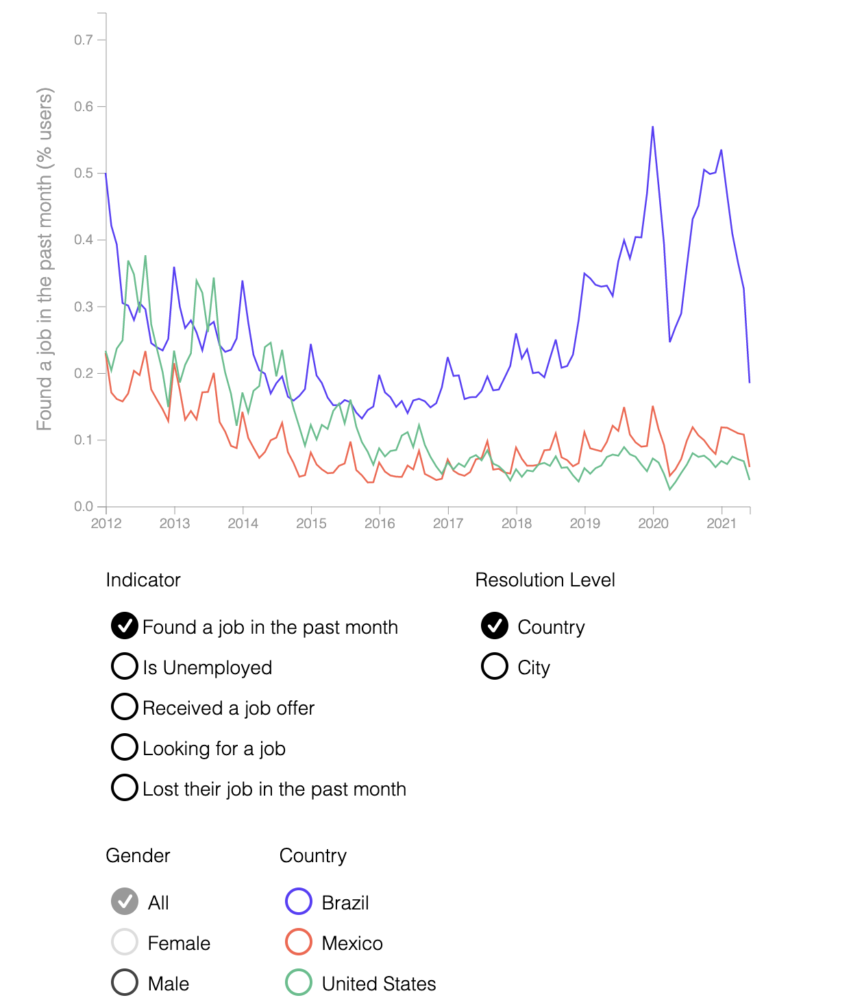
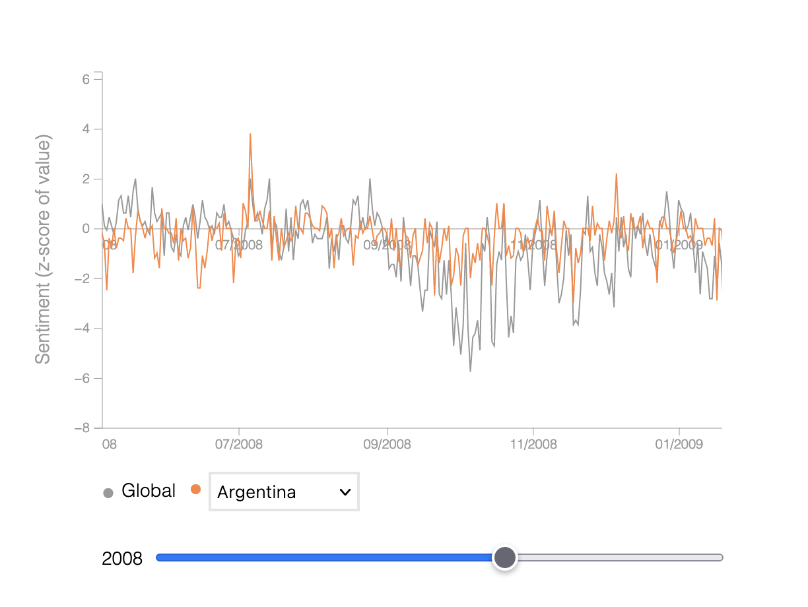

# SDG-big-data

This repository is comprised by three main analysis components in which we detail the use of big data as a tool for policy making based on evidence.
This work is centered around two major areas; Mobility and Natural Language Processing (NLP).
For the mobility analysis we used individual GPS records in order to characterize the behavioral response to the COVID-19 pandemic in terms on the *stay at home* mandates and social distancing recommendations. For the NLP study there are two different goals, one is to build labor market indicators from Twitter data while the other one is to understand the sentiment around news.

## GPS

We analyzed GPS data from 6 different countries to understand the differences in “stay at home” mandates for different socioeconomic groups. A summary plot of our results is displayed in the interactive chart below. The first panel represents the percentage change of the total time spent at home by socioeconomic group, the second one is the percentage change of daily users commuting to work also by socioeconomic group and the last one shows the percentage change of work commutes in the low-income group by the wealth of the neighborhood where the work is located.

## Labor Market

Online social networks, such as Twitter, play a key role in the diffusion of information on jobs. For instance, companies and job aggregators post job offers while users disclose their labor market situation seeking emotional support or new job opportunities through their online network. In this context, Twitter data can be seen as a complementary data source to official statistics as it provides timely information about labor market trends.

In this project, we leverage state-of-the-art language models (Devlin et al, 2018) to accurately identify disclosures on personal labor market situations as well as job offers. The methodology is presented in this [IC2S2 2020 presentation](https://www.youtube.com/watch?v=ZxFrtUW2dYA) and detailed in Tonneau et al. (2021) (in review). Aggregating this individual information at the city and country levels, we then built Twitter-based labor market indexes and used them to better predict future labor market trends.

The indicators resulting from this study can be found below, for the US, Brazil and Mexico. The x-axis corresponds to the share of Twitter users we inferred in a given month to:
- have found a job
- be unemployed
- have shared a job offer
- be looking for a job
- have lost their job

## News Analytics
We take news articles focusing on a specific country and compute the sentiment associated with the article. The methodology is detailed in [Fraiberger et al. (2021)](https://doi.org/10.1016/j.jinteco.2021.103526) with an application to understanding international asset prices.

